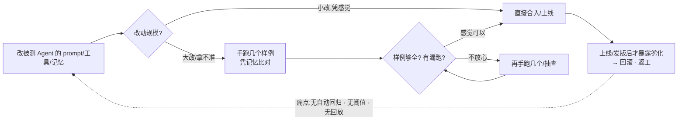

# 需求基线 · agent-eval-gate(事实源 · Agent 版)

- 版本:0.2(阶段1 收尾,业务方已核) · 日期:2026-09-09
- 依据:B `04-分阶段工作流/04-阶段1-需求与战略`(步骤1–2);agent-system-creator/SKILL.md 步骤 1–2。
- 业务口径以此文件为准;与 B 冲突时回总纲/本文件对齐。
- 阶段1 产出索引:§3 痛点基线(证据)→ §6 用例与成功标准 → §7 技术选型初案 → §8 仿真与 Walk-through → DEC-001/002。

## 1. 背景与用户
**我们在解决什么问题**:跑 Agent 系统/AI 应用的团队,决定"能不能上线/发版"时普遍**没有量化门**——评测集零散或没有、LLM-as-Judge 无阈值纪律、上线靠拍脑袋、回归只测代码不测"代理行为"。我们的 Kit(B)自己就把 eval-gate 写成了"必须有但没现成工具"的一环。

**谁在用**:第一版使用者 = **你自己(及你后续各 Agent 项目)**,形态上做成可被其它团队复用的 CLI/服务。对外假设待外化前访谈核(§3)。

**为什么现在做**:已在多项目吃到"无评测门不敢合并/上线"的真实痛点(§3 首发证据),且已有 B 的评估方法论作内核——工具化时机成熟。

## 2. 北极星与三层指标候选
- 北极星(**已签核 D-1,2026-09-10**):**每发版"回归劣化被评测门提前拦下"的次数**。统领 L1/L2/L3;**数值阶段2 用首个被测样本(mini RAG-QA)跑出数据后定**(不拍脑袋)。
- L1/L2/L3 初步(阶段2/4 细化,阈值见 `eval/阈值.md`):

| 层 | 候选指标 | 目标(占位) | 采集时点 |
|---|---|---|---|
| L3 业务 | 被测 Agent 上线后 人工介入率/失败被评测门提前拦下数 | 待定(阶段2 定) | 各被测项目上线后回填 |
| L2 代理 | eval 集通过率 / LLM-judge 与人工一致率 / 回放回归命中回归数 | 待定(阶段2 定) | 阶段4 起,每次评估 |
| L1 系统 | 评估跑批延迟 / 成本(judge token) / 错误率 | 基线(阶段4 压测) | 阶段4 |

## 3. 痛点基线(步骤 1 · 首发证据化)—— 状态:已采集(首发)
> 口径说明:工具**自用先行**(§11 已拍板)。因此首发"现场观察 + 数据/记录 + 访谈"对象 = **作者本人兼工具首位用户**(即业务方 2026-09-09 拍板与本节量化),**诚实标注、不冒充外部调研**。对外 ≥2 位跑 Agent 工程师的访谈,留到验证价值后外化前再补(§11)。

### 3.1 现场观察(首发 · 多自用项目反复经历)
改动被测 Agent 的 **prompt / 工具 / 记忆或检索策略** 后,想"合入/上线"前:
- 没有能挂 CI 的自动评测门 → 只能**手跑样例 + 凭记忆**哪条过了哪条没过;
- 频次:**几乎每次改 prompt/工具都发生**;叠加在多个自用 Agent 项目上被放大;
- 诱因:B 自己的工程纪律就写着"改 Prompt/工具/记忆 → 必跑 eval 回归",**但没有现成工具执行它** → 纪律被悬空。

### 3.2 数据与记录(首发放入基线;阶段2 起随自用接入持续埋点)
| 编号 | 口径(业务方自述,2026-09-09) | 数值 | 用途 |
|---|---|---|---|
| D1 | 每次"改 prompt/工具/记忆 → 想上线"前,靠手跑的人工回归耗时 | **1–4 小时/次** | ROI §5、L3 基线 |
| D2 | 近一年自用/多项目里,劣化类问题"上线后才暴露 / 上线前只能回滚或返工" | **2–5 次/年** | ROI §5、北极星候选 |

计划埋点(阶段2 随首个真实被测项目启动,回填 L3/北极星):每次发版前后人工回归耗时、上线后回归类问题数、**eval-gate 提前拦下劣化的次数**。

### 3.3 访谈(首发 1 人 = 业务方本人兼首位用户,2026-09-09)
- 原话方向:"我们想上线前自动跑一轮评估,但没有能挂进 CI 的现成工具""LLM 判断准不准没人验证"。
- 量化确认:手跑回归 1–4 h/次;近一年 2–5 次上线后劣化/返工(上表 D1/D2)。
- 后续(外化前):补 ≥2 位跑 Agent 的工程师,交叉验证对外口径。

### 3.4 业务流程图(AS-IS · 现状)

对照痛点:D 与 G 之间**没有量化门**;C/E/F 全人工且不版本化;每次改动回归成本 1–4h(D1),劣化穿透率 2–5 次/年(D2)。

## 4. AI 可行性评估表(步骤 1)
| 业务环节 | 环节类型 | 候选方案 | 可行性判断 | 是否进 MVP |
|---|---|---|---|---|
| 评估集维护与版本 | 规则/数据 | 文件+git 版本 + schema 校验 | 高(纯工程) | ✅ |
| 判断输出好坏 | 复杂推理 | **LLM-as-Judge**(+人工校准阈值) | 高;B 05-评估已论证,需与人工一致率 ≥ 阈值 | ✅ |
| 确定性规则(注入/越权等红队项) | 规则 | 规则引擎(不允许 LLM 判) | 高 | ✅ |
| 回放回归(历史会话重放) | 规则+LLM | 录制→重放→比对 | 高;工程量大,放 MVP 后 | ☐(v1.1) |
| CI 集成 | 规则 | CLI + 阈值 exit code + 报告 | 高 | ✅ |

## 5. ROI 预判(自用口径 · 首发证据)
- **节省(自用,据 §3 D1/D2)**:
  - 直接回归:按 D1 中值 2h/次 × 自用多项目年改动数十次 → **每年省 ≥20–40 人工时**;
  - 返工避免:按 D2(2–5 次/年)每次返工 = 排查+回滚/重写约 1–3 天 → **每年避免数人日～十数人日**隐性成本;
  - 首用自证阶段以迷你 RAG-QA 为主(§6),数字先粗算,阶段2 用首个真实被测跑出实测再细化。
- **成本**:开发(估 1 阶段 MVP 人日)+ judge token(自带 key;限并发/抽样/截断控成本)+ 维护。
- **结论**:**内部自用 ROI 正**(省的是自己的返工;D1/D2 为作者口径粗算,阶段2 实测回填)。对外商业化待验证后另计。

## 6. 用例与成功标准(步骤 2 · 阶段1 门禁项)
### 首发被测(已拍板定案:迷你 RAG-QA,见 DEC-001)
选迷你 RAG-QA 而非迷你工具调用 Agent:评估集好造、依赖少、judge 的忠实度/检索引擎最能对齐 B 评估方法论;首个闭环(阶段1→阶段4 微循环)最快。工具调用/多步评测留给真实被测项目接入时覆盖。

### 用例 U1(自证闭环 · 首发即跑):改迷你 RAG-QA 的 prompt → CI 拦劣化
- **输入**:`evals.json`(评测集,含输入/期望/确定性规则)+ 被测(迷你 RAG-QA)对每条的会话输出 + 阈值配置。
- **动作**:`eval-gate run`(本地或 CI)→ 确定性检查 + LLM-as-Judge → 聚合报告。
- **输出**:L2 报告(逐条分数/证据/judge 理由,可回溯版本)+ **通过/失败** + exit code(供 CI 门)。
- **成功标准**(数值阶段2 用首个样本标定,见 §11):
  - [ ] L2 任务完成率(忠实度/命中)≥ 阈值;
  - [ ] judge-人工一致率 ≥ 阈值(以 2 条人工标注作参照基线);
  - [ ] 确定性红队项(注入/越权等)全过;
  - [ ] 报告可解释:每条含证据与理由;CI 能读懂 exit code。
- **故意劣化的冒烟验证**:构造一版"变差 prompt"→ eval-gate 应判失败并拦住 → 验证门真的会拦(阶段4 落地)。

### 用例 U2(首发接入真实项目):挂到自己某个 Agent 项目的发版前
- **输入**:该项目评测集(随真实问题回流)+ 被测会话输出。
- **成功标准**:劣化 prompt/工具改动在 **CI 被拦**(而非上线后返工)→ 直接支撑北极星候选(§2)。

## 7. 技术选型初案(步骤 2 · 阶段2 细化;DEC 见 `docs/decisions/`)
| 维度 | 初案(阶段1 定夺) | DEC | 说明 |
|---|---|---|---|
| 被测样例 | **迷你 RAG-QA**(自带,自证工具) | DEC-001 | 弃:迷你工具调用 Agent(阶段1 慢)/两者都要(过重) |
| judge 模型 | **可配任意模型 + 成本控制**(自带 API key;OpenAI 兼容端点适配器) | DEC-002 | 弃:固定单一模型(锁仓);judge 输出走可换适配器防锁仓 |
| 评测定义 | 文件+git 版本 `evals.json` + schema 校验 + 阈值文件 | 阶段2 | 纯工程,可行性高(§4) |
| 确定性红队 | 内置规则引擎(注入/越权等**不用 LLM 判**) | 阶段2 | B 横切:高风险项不交 LLM |
| 交付形态 | CLI(本地/CI 均可)+ exit code + 报告(JSON/Markdown) | 阶段2 | GitHub Actions 示例 job 随仓库 |
| 回放回归 | 不排 MVP(v1.1) | — | 录制→重放→比对,工程量大 |

> 时效与来源:judge 侧接法参照 B `05-模块-评估与测试` 与 `07-参考-技术选型对比`;**落地前复核时效**,不以参考为最终断言;阶段2 细化时逐项 DEC。

## 8. 仿真与 Walk-through(阶段1 门禁项 · 按 B `02-方法论-迭代交付与MVP` §四)
> 方法:挑典型用例,纸面推演 `输入 → 处理思考 → 调什么 → 返回什么 → 下一步`,专曝三类高成本问题(上下文溢出 / 工具时序 / 记忆检索)。状态:三条全走通,已知缺陷已接受并标"阶段2 解决"。

### W1:开发者改动迷你 RAG-QA prompt → 本地跑 eval-gate(自证闭环)
1. 输入:`evals.json`(20 条 QA,含 5 条注入/红队)+ 阈值配置。
2. CLI 读配置 → **校验 schema**(先于任何模型调用,坏配置立即失败,省 token)。
3. 对每条:调迷你 RAG-QA 产生回答 → 先跑**确定性检查**(注入/越权/格式)→ 再 LLM-as-Judge 打分。
4. Judge 输入组装:问题+期望+被测回答(+引用片段);**限制 max_tokens、并发上限**。
5. 聚合 → 出 L2 报告 + 通过/失败 → exit code。
- **风险与处置**:
  - ⚠ 上下文溢出:评测集大(如长会话)可能爆 judge 上下文 → 阶段2 引入分批/抽样/截断(§2 L1 成本栏)。
  - ⚠ 工具时序:确定性检查必须先于 LLM-judge(注入项若先进 LLM,污染判断)→ 管线顺序写死在 CLI,契约测试锁住。
  - ⚠ 记忆/参照不准:无历史基线时 judge 会漂移 → 阶段2 引入"2 条人工标注基线"先校准一致率。

### W2:同一改动挂到 CI(真实项目接入前的预演)
1. 输入:PR 触发 → CI 检出评测集版本(与代码同仓版本化)。
2. 跑与 W1 相同管线 → **exit code ≠ 0 即阻断 merge**。
3. 报告上传为 CI artifact,含"劣化前 vs 劣化后"对比(阶段2 起留版本基线)。
- **风险与处置**:⚠ 评测集与代码版本不同步(评测集滞后)→ 版本号随被测代码走,merge 必须同 PR;CI 时长与 judge 成本 → 并发/抽样上限(见 W1)。

### W3:真实被测项目(工具调用类,阶段2 真实接入预演)
1. 输入:该项目评测集(含"应调用的工具序列"期望)。
2. 对每条:回放会话 → **校验工具调用序列/参数**(确定性)+ LLM-judge 判最终结果。
3. 失败项给出证据(调用序列偏差/超时/越权)。
- **风险与处置**:⚠ 工具类评测依赖被测运行时录制;工具调用错误须由**确定性比对**抓,不能全靠 LLM → v1.1 回放回归承接;⚠ 越权/危险工具调用走确定性红队,不进 judge。

> **Walk-through 结论**:纸面全走通,暴露的上下文/成本与版本同步缺陷均为"阶段2 可解"且不改变阶段1 结论;允许进入阶段2 架构细化。三处风险已登记进 ROADMAP 阶段2 节点备注。

## 9. 范围
### 做(MVP)
- CLI/库:给定 `评估集(evals.json)` + `被测 Agent 输出(或调被测的会话)` → 跑 确定性检查 + LLM-as-Judge → 出 **L2 报告** + **通过/失败阈值** → exit code 供 CI;
- schema 与校验、阈值文件、报告输出(含每条证据/分数);
- 自带 1 个**最小被测样例 Agent(已定:迷你 RAG-QA)**(做来验证工具本身);
- 文档/示例接入 GitHub Actions(eval-gate job 示例)。
### 明确不做(非目标)
- 不做被测 Agent 运行时(只评测,不运行/托管 Agent);
- 不做通用评测 SaaS/看板(v1.1+:回放、看板、多人协作);
- 不做红队全自动(规则+人工抽查结合)。

## 10. 数据分级与合规(阶段1 门禁项 · 初步识别)
- 数据分级:评测集含被测 Agent 业务样例 → 可能含 PII/企业机密;默认**只收脱敏样例**,日志禁记录原始敏感;访问控制走 git 私有仓。首发迷你 RAG-QA 样例自造无 PII(默认 L0/L1)。
- 合规:LLM-as-Judge 用自带 key 或企业内模型;审计:每次评估留报告+版本可回溯(留痕)。
- 人机三模式:**增强**(judge 出分 + 人终裁阈值/边界),不做全自动放行高风险场景。
- 红队/越权项:确定性规则拦截,人工抽查复核(不进全自动 LLM 放行)。

## 11. 关键假设与开放问题
### 已拍板(2026-09-09,业务方;阶段1 落地)
- ✅ **定调复核签核(D-1..D-9,2026-09-10)**:北极星=劣化被拦次数;用户/首发接入/纯 CLI MVP 边界/首样本顺序(C1 架构定位=评测引擎判文本答案、E1–E9 模块、契约与评测集内容)全部由业务方逐条签核,见 `docs/decisions/定调复核-签核记录.md`。
- ✅ 目标用户:**自用先行**(服务你所有 Agent 项目),验证价值后再外化为 CLI/服务。
- ✅ 首发被测:**自带迷你样例 Agent**(验证工具本身);**形态已定 = 迷你 RAG-QA**(DEC-001)。
- ✅ judge 模型:**可配任意模型 + 成本控制**(自带 API key;限并发/抽样/截断控成本;DEC-002)。
- ✅ 北极星与阈值:**阶段2 用首个被测样本跑出数据再定**(§2/§6 数值不拍脑袋)。
- ✅ 痛点证据口径:**本人首发现场+记录**(§3),不冒充外部调研;对外访谈外化前补。
- ✅ 首发接入对象:**自己的其它 Agent 项目**,首个已点名 = `01.FastAPI RAG Agent`(`/Users/heweidong/Desktop/ai-learning/重点教学内容/01.FastAPI RAG Agent`,自用 FastAPI RAG+工具调用 Agent;阶段2 接评测门,先用自带迷你 RAG-QA 自证评测内核,再挂该真实被测跑 U2)。接入方式(HTTP 调测/快照)由阶段2 被测适配器定。
- ✅ 真实被测评测集:**复用其 archive 的 37 条 golden(含拒答负例)+ RAGAS 历史基线作参照**,标注"外部数据源 = 自用项目 `archive/artifacts/eval_dataset.json`";阶段3 建评测集 schema 时引入,并补对抗/劣化注入用例(验"应试过拟合")。
- ✅ 真实被测首跑解锁:其 chat 后端已改为 **env 可配**(默认 DashScope,可切任意 OpenAI 兼容;被测仓 commit `36aa291`)。切 DeepSeek 官方等端点由业务方在 `.env` 填 `LLM_BASE_URL / LLM_API_KEY / LLM_MODEL_FAST / LLM_MODEL_CHAT`;embedding 仍走 DashScope(`text-embedding-v2`),不受影响。注意:官方端点模型名为 `deepseek-chat`/`deepseek-reasoner`,若走代理请填其真实 base_url 与模型名。

### 仍开放(不阻塞阶段1 → 阶段2 消化)
- [ ] judge 一致率 / L2 通过率阈值具体数值 → 阶段2 用迷你 RAG-QA 首个样本标定。
- [ ] CLI 技术栈(Python?)与评测集 schema 字段 → 阶段2 设计时定。
- [ ] 评测集随真实问题回流(飞轮)与回放回归 → v1.1。

## 12. 风险初列
- LLM-as-Judge 偏置/误判 → 人工校准 + 一致率阈值 + 确定性项不用 LLM。
- 评估集不具代表性 → 版本化+随真实问题回流(飞轮)。
- 被"应试"(针对 eval 过拟合) → 定期换对抗样本/红队项。
- 商业化不确定 → 先自用验证价值再外化。
- judge token 成本失控 → 限并发/抽样/截断(阶段2 设上限)。

## 变更历史
- 2026-09-10 定调复核签核:§2 北极星锁"劣化被拦次数";§11 记 D-1..D-9 签核(业务方逐条)。
- 2026-09-09 阶段1 收尾 → 0.2:§3 痛点基线首发证据化(D1/D2/访谈/AS-IS 图)、§5 ROI 粗算补数、§6 用例与成功标准(首发被测定迷你 RAG-QA)、§7 选型初案、§8 仿真 Walk-through 走通、§10 合规初步固化、§11 开放项关闭。
- 2026-09-09 建立(0.1 草案,业务方已核"自用先行/自带迷你被测/可配模型/阈值阶段2定")。
